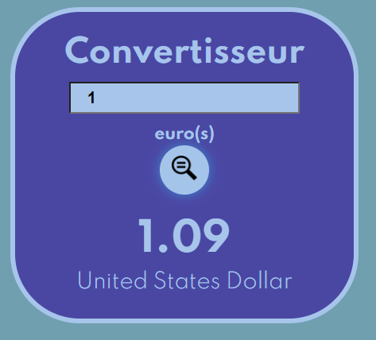
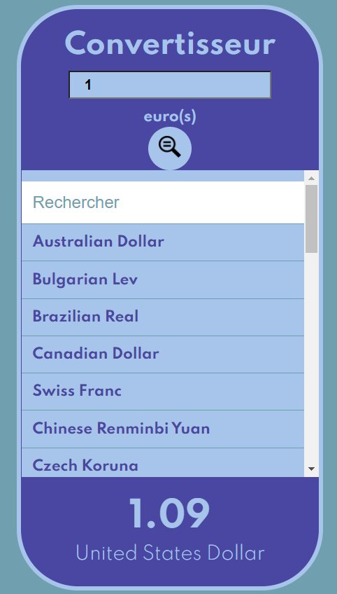

# Convertisseur

Exercice avec react
Ici sans appel API

## Rendu final

# installe les dépendances du projet
yarn 

# lance le serveur de developpement
yarn start 

rdv sur http://localhost:8080/

# build de production : les fichiers sont rassemblés *et optimisés*
yarn build

